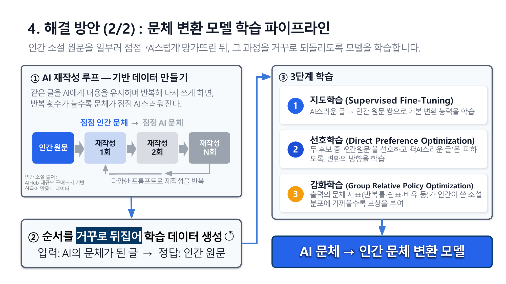
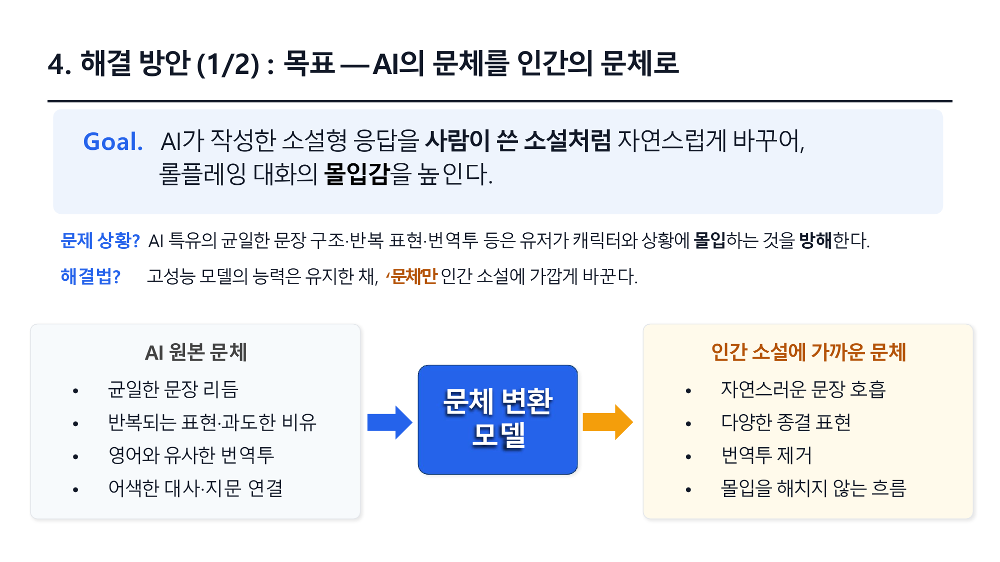
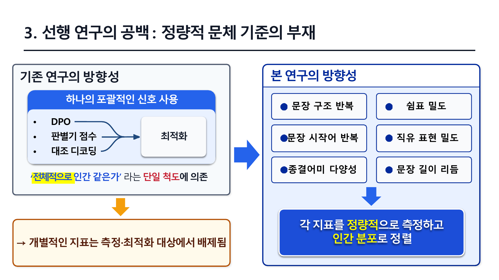
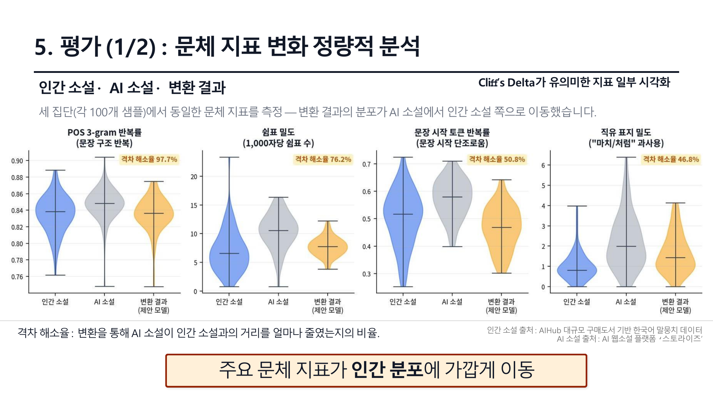
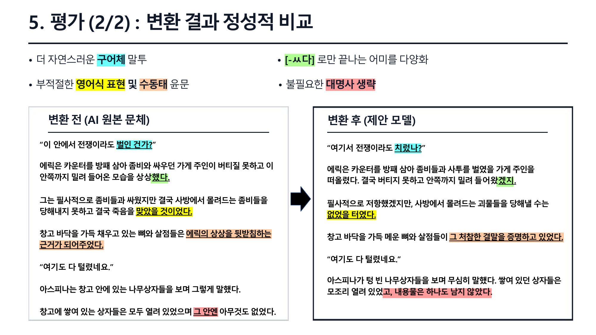
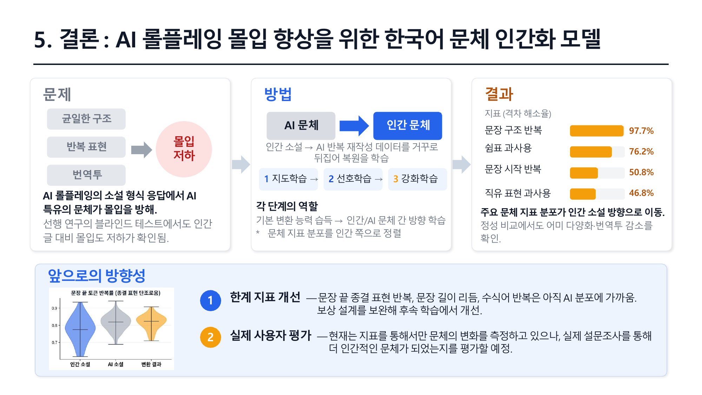

# AI 롤플레잉 몰입 향상을 위한 한국어 문체 인간화 모델

대형 언어 모델(LLM)이 생성한 한국어 롤플레잉 응답을 사람이 쓴 웹소설 문체에 가깝게 변환하기 위한 캡스톤 프로젝트입니다.  
AI 특유의 균일한 문장 구조, 반복 표현, 쉼표 과사용, 번역투, 과도한 직유 표현을 정량 지표로 측정하고, SFT -> SimPO/CPO -> GRPO 학습 파이프라인으로 문체를 인간 소설 분포에 가깝게 이동시키는 것을 목표로 했습니다.



## 프로젝트 소개

AI 롤플레잉 서비스는 지문과 대사가 결합된 소설형 응답을 사용합니다. 사용자는 완성된 이야기를 읽는 독자가 아니라, 캐릭터와 실시간으로 상호작용하는 참여자에 가깝기 때문에 문체의 자연스러움이 몰입감에 직접적인 영향을 줍니다.

본 프로젝트는 고성능 범용 LLM의 지식과 대화 능력은 유지하면서, 최종 출력의 문체만 한국어 인간 웹소설에 가깝게 교정하는 후처리 모델을 제안합니다.



## 핵심 아이디어

인간 소설 원문을 AI에게 반복 재작성하게 하면, 반복 횟수가 늘수록 문체가 점점 AI스럽게 변합니다. 이 과정을 거꾸로 뒤집어 `AI 문체가 된 글 -> 인간 원문` 형태의 학습 데이터를 만들고, 모델이 AI 문체를 인간 문체로 복원하도록 학습했습니다.

학습은 세 단계로 구성했습니다.

| 단계 | 역할 | 대표 코드 |
|---|---|---|
| SFT | AI스러운 글을 인간 원문으로 바꾸는 기본 변환 능력 학습 | `pipeline_v2/train/stage08a_sft_anchor_from_stage07i.py` |
| SimPO/CPO | 인간 원문을 선호하고 AI스러운 후보를 피하도록 방향성 학습 | `pipeline_v2/train/stage08b_simpo_cpo_from_stage08a.py` |
| GRPO | 출력 문체 지표가 인간 소설 분포에 가까워질수록 보상 부여 | `pipeline_v2/train/stage08c_grpo_generate_trl_vllm.py`, `pipeline_v2/train/stage08d_grpo_rewrite_from_stage08c.py` |

## 문체 지표

기존 인간화 연구가 "전체적으로 인간 같은가"라는 단일 신호에 의존하는 한계를 보완하기 위해, 본 프로젝트는 개별 문체 특징을 정량화했습니다.



주요 지표는 다음과 같습니다.

| 지표 | 의미 |
|---|---|
| POS n-gram 반복률 | 유사한 문장 구조가 반복되는 정도 |
| 쉼표 밀도 | 1,000자당 쉼표 수와 쉼표 포함 문장 비율 |
| 문장 시작/종결 토큰 반복률 | 문장 경계 표현의 단조로움 |
| 직유 표지 밀도 | "마치", "처럼", "같이", "듯이" 등 비유 표지 과사용 |
| 문장 길이 리듬 | 문장 길이의 다양성과 호흡 |
| 수식어 반복 | 같은 부사/관형 표현의 반복과 밀집도 |

관련 구현:

- `pipeline_v2/eval/phase_eval/metrics_gui_compatible.py`
- `pipeline_v2/lib/gui_style_scoring.py`
- `pipeline_v2/eval/phase_eval/score_and_report.py`

## 평가 결과

인간 소설, AI 소설, 변환 결과 각 100개 샘플에서 동일한 문체 지표를 측정했습니다. 변환 결과의 분포가 여러 핵심 지표에서 AI 소설보다 인간 소설 방향으로 이동했습니다.



| 개선 지표 | 격차 해소율 |
|---|---:|
| POS 3-gram 반복률 | 97.7% |
| 쉼표 밀도 | 76.2% |
| 문장 시작 토큰 반복률 | 50.8% |
| 직유 표지 밀도 | 46.8% |

정성 비교에서도 더 자연스러운 구어체, 종결 어미 다양화, 부적절한 영어식 표현 감소, 불필요한 대명사 생략을 확인했습니다.



## 저장소 구조

```text
.
├── README.md
├── assets/
│   ├── figures/                 # README용 핵심 발표 이미지
│   └── presentation/            # 발표자료에서 추출한 원본 이미지
├── data/
│   └── metrics/                 # 발표 및 평가에 사용한 문체 지표 CSV
├── docs/
│   ├── final_presentation.pdf   # 최종 발표자료
│   └── final_presentation_slide_text.md
├── pipeline_v2/
│   ├── scripts/                 # 데이터 구축, 평가 세트 준비, 실행 번들
│   ├── train/                   # SFT, SimPO/CPO, GRPO 학습 코드
│   ├── eval/                    # 고정 평가 및 문체 지표 리포트
│   ├── lib/                     # 공통 로더, LoRA, reward, scoring 유틸
│   └── docs/                    # 세부 runbook 및 실험 메모
├── requirements-unsloth.txt     # Unsloth 기반 학습 환경
└── requirements-vllm.txt        # TRL + vLLM GRPO 환경
```

## 실행 개요

대형 Gemma 계열 모델과 LoRA 학습을 전제로 하므로 일반 로컬 PC가 아니라 CUDA GPU 서버에서 실행해야 합니다. 원본 소설 데이터와 모델 체크포인트는 라이선스와 용량 문제로 저장소에 포함하지 않았습니다.

Unsloth 기반 SFT/SimPO 환경:

```bash
pip install -r requirements-unsloth.txt
```

vLLM 서버 모드 GRPO 환경:

```bash
pip install -r requirements-vllm.txt
```

Stage08 전체 실행 번들:

```bash
cd pipeline_v2
python scripts/35_run_stage08_sft_simpo_grpo_chain.py --report-to none
```

개별 단계 실행 예시(저장소 루트에서 실행):

```bash
python -m pipeline_v2.train.stage08a_sft_anchor_from_stage07i --report-to none
python -m pipeline_v2.train.stage08b_simpo_cpo_from_stage08a --report-to none
python -m pipeline_v2.train.stage08d_grpo_rewrite_from_stage08c --report-to none
```

평가 지표 산출:

```bash
python pipeline_v2/eval/phase_eval/score_and_report.py
```

## 결론



본 프로젝트는 AI 롤플레잉 응답의 몰입을 저해하는 문체 특징을 정량화하고, 이를 직접 최적화 대상으로 삼는 한국어 문체 인간화 파이프라인을 구현했습니다. 주요 지표는 인간 소설 분포 방향으로 이동했으며, 향후에는 아직 AI 분포에 가까운 종결 표현 반복, 문장 길이 리듬, 수식어 반복 지표를 개선하고 실제 사용자 설문 평가로 몰입도 변화를 검증할 계획입니다.
